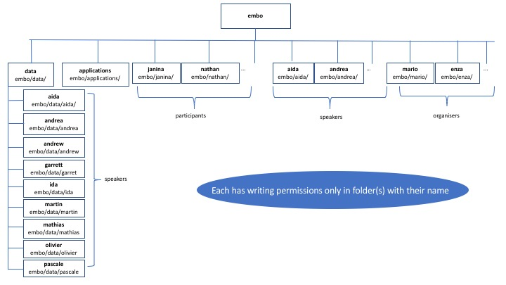

##  WiFi

network name: embo2017

password: popgen

##  SSH
For this course we will work on the High Performance Cluster of the [Istituto Nazionale di Fisica Nucleare](https://www.ba.infn.it/index.php/en/)

The filesystem has been generated according to this structure




To connect to the INFN machine using SSH from a Linux terminal use:

```
ssh -Y yourusername@elixir.recas.ba.infn.it
```
the -Y tag enable graphical options

Username and password were given to you at the reception

## Open pdfs on the INFN machine

To open pdfs use [evince](https://en.wikipedia.org/wiki/Evince)

```
evince  mypdf.pdf
```


 #### thanks to Giacinto Donvito, Stefano Nicotri, Mario Aversano, Claudia Rallo
