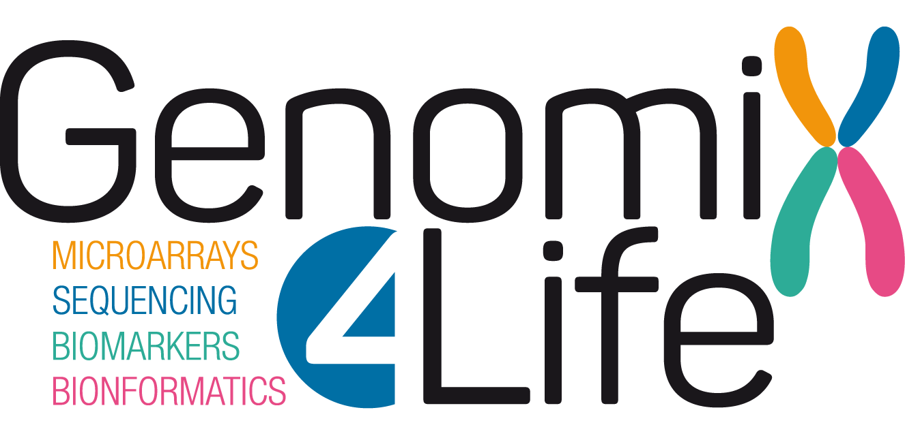

#### PRACTICAL COURSE

# POPULATION GENOMICS: BACKGROUND AND TOOLS
### Naples, Italy 21-27 April 2018

## Go to the [official ELIXIR website](https://elixir-iib-training.github.io/website/2018/04/21/PopGen-Napoli.html)

<table style="width:100%">
   <tr>
     <td></td>
     <tr/>
</table>

<table width="700">
   <tr>
   <td></td>
   <td></td>
   <td></td>
   <td width="50"></td>
     <td></td>
      </tr>
      <tr>
      <td></td>
      <td width="100"></td>
      <td align="right"></td>
      <td width="100"></td>
        <td align="right"></td>          
        </tr>
        <tr height="50"></tr>
   <tr>
    <td colspan="4"><b>#popgenelixir</b></td>    
   </tr>
</table>

## Before we start
<a href="https://elixir-iib-training.github.io/website/">

- What is my project about?

- Why am I here?

## Connections
WiFi and SSH instructions [here](WiFi-SSHinstruction.md)

## Timetable

#### Speakers schedule
- Andrés Aida 26-27 April
- Manica Andrea 21-27 April
- Clark Andrew 21-24 April
- Hellenthal Garrett 24-25 April
- Moltke Ida 21-25 April
- Sikora Martin 23-24 April
- Currat Mathias 23-26 Aprily
- Delaneau Olivier 20-22 April
- Gerbault Pascale 23-26 April

#### All raw data and software are available on the INFN machine

Days |Lessons  | Tutorials |
------------ | ------------- | ------------- |
day 1 |[Opening Lecture](day1/clark/EMBOClarkOverview.pdf) - [Data QC and ExploratoryData Analysis I](day1/delaneau/session1_course.pdf)|[Linux Tutorial](day1/colonna/Academis_Linux.pdf) - [OnePageLinuxManual](day1/colonna/OnePageLinuxManual.pdf) - [Data QC and ExploratoryData Analysis/home/enza/ezcngit/POPGEN2018/day6/currat/ElixirPopGen_MatCurrat_Practicals_18.pdf I](day1/delaneau/session1_practical.pdf)|
day 2 |[Phasing and Imputation](day2/delaneau/session2_course.pdf)|[Phasing and Imputation](day2/delaneau/session2_practical.pdf)|
day 3 |[Coalescence theory made fun and easy](day3/clark/DerivationofCoalescent_Clark.pptx)|[Coalescence](day3/clark/CoalescenceExercises2018.pdf) - <a href="http://popgen.dk/ida/Naples2018/web/">Relatedenessand IBD</a>|
day 4 |[Population admixture from genomic data](day4/sikora/lecture_fstats.pdf) | [Admixture Practical 1](day4/sikora/practical1.sh) -  [Admixture Practical 2](POPGEN2018/day4/sikora/practical1.sh)|
day 5 |[Clustering Algorithms](day5/hellenthal/ClusteringAlgorithmsLecture.pdf)- [Haplotype Based Demography](day5/hellenthal/HapBasedDemographyLecture.pdf) |[Clustering Algorithms Practical](day5/hellenthal/ClusteringAlgoritmsPractical.pdf) - [Haplotype Based Demography Practical](day5/hellenthal/HapBasedDemographyPractical.pdf)|
day 6 |[ABC](day6/currat/ElixirPopGen_MatCurrat_Presentation_18.pdf)|[ABC Practicals](day6/currat/ElixirPopGen_MatCurrat_Practicals_18.pdf)|
day 7 |[GWAS](day7/manica/2018NaplesGWASslides.pdf) - [Species divergence](day7/andres/Napoli_May2018_lecture.pdf)|[GWAS practical](day7/manica/GWAS_handout.pdf) - [Species divergence practical I](day7/andres/ELS_TutorialFile.txt) - [Species divergence practical II](day7/andres/MK_TutorialFile.txt)|

## Pompei - Ercolano

<table style="width:100%">
   <tr>
     <td></td>
     <tr/>
</table>

[Pompei](https://en.wikipedia.org/wiki/Pompeii) and [Ercolano](https://en.wikipedia.org/wiki/Ercolano) are two famous archaeological sites that lie in the shadow of [mount Vesuvius](https://en.wikipedia.org/wiki/Mount_Vesuvius), the active volcano that dominates the area.

They were destroyed by pyroclastic flows during the massive eruption of Vesuvius in 79 AD.

Go to the central train station at Piazza Garibaldi. You'll find the Circumvesuviana (the train system that connects the Napoli and the towns and cities in the region around Vesuvius) on the lower level of the station. Buy tickets (about 3 euro each way) and take the Circumvesuviana to Pompei _Scavi_. Note that other regional trains go to the modern city of Pompei but you will need to walk about 25 minutes from that station to the archaeological site while the station Pompei Scavi is just a few minutes from the entrance to the park. A single cafeteria serves the site, so you may want to bring snacks. It can be hot and there is virtually no shade, so dress accordingly. Pompei is a vast ruin, and a walk through most of it should take at least three hours.

Ercolano lies on the same train line as Pompei, but is closer to Napoli. To get there, leave the Circumvesuviana at Ercolano Scavi, and walk down the hill towards the sea for about ten minutes. Ercolano is much smaller than Pompei, but what it lacks in size it makes up in the quality of its preservation. It is possible to visit both sites in one day, but you will probably want to start early.
