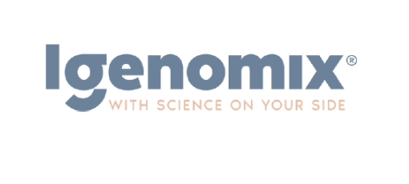
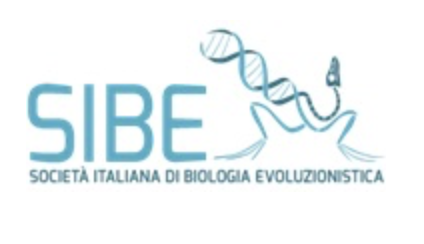

#### PRACTICAL COURSE

# POPULATION GENOMICS: Background, tools, and programming
### Virtual, 22 – 30 March 2022

## Go to the [official EMBO website](https://embo-popgen.centercongressi.com/faculty.php)

## Connections
SSH instructions [here](SSHinstruction.md)

## Repos with teaching materials
| Speakers | Teaching materials |
|--------------------|-----------------|
|[Anders Albrechtsen](http://www.popgen.dk/groupWiki/index.php/Anders_Albrechtsen)| [materials](Anders_Albrechtsen) |
|[Anna-Sapfo Malaspinas](https://www.sib.swiss/anna-sapfo-malaspinas-group)| [materials](Anna-Sapfo_Malaspinas) |
|[Andrea Manica](https://www.zoo.cam.ac.uk/directory/andrea-manica)| [materials](Andrea_Manica) |
|[Benjamin Peter](https://www.eva.mpg.de/genetics/staff/benjamin-peter.html)| [materials](Benjamin_Peter) |
|[Dan Schrider](https://www.schriderlab.org)| [materials](Dan_Schrider) |
|[Leo Speidel](https://leospeidel.com)| [materials](Leo_Speidel) |
|[Daniel Wegmann](https://www.unifr.ch/bio/en/research/conservation-biology/wegmann-group.html)| [materials](Daniel_Wegmann) |
|[Amy Goldberg](https://www.goldberglab.org)| [materials](Amy_Goldberg) |
|[Nina Jablonski](https://sites.psu.edu/ninajablonski/)| [materials](Nina_Jablonski) |
|[Kirstie Whitaker](https://www.turing.ac.uk/people/researchers/kirstie-whitaker)| [materials](Kirstie_Whitaker) |
<table style="width:100%">
   <tr>
     <td></td> <td><a href="https://twitter.com/hashtag/EMBOpopgen?src=hashtag_click"><b>#EMBOpopgen</b></td>    
     <tr/>
</table>

<table width="700">
   <tr>
   <td></td>
   </tr>
   <td></a></td>
   <td width="100"></td>
   <td></td>
   <td width="100"></td>
   <td align="center"></td>
      </tr>
      <tr>
      <td></td>
      <td width="100"></td>
      <td align="right"></td>
      <td width="100"></td>
      <td align="center"></td>
   </tr>
   <tr>
</table>
