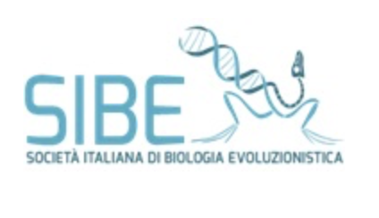
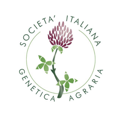

#### PRACTICAL COURSE

# EMBO Course in Population Genomics
### Procida,Italy 13 - 19 March 2023

## Go to the [official EMBO website](https://meetings.embo.org/event/23-pop-genomics)

## Connections

SSH instruction

## Repos with teaching materials
| Speakers | Teaching materials | 
|--------------------|-----------------|

<table style="width:100%">
   <tr>
     <td></td> <td><a href="https://twitter.com/hashtag/EMBOpopgen?src=hashtag_click"><b>#EMBOpopgen</b></td>    
     <tr/>
</table>

<table width="700">
   </tr>
   <td></a></td>
   <td width="100"></td>
   <td></td>
   <td width="100"></td>
   <td align="center"></td>
      </tr>
      <tr>
      <td></td>
      <td width="100"></td>
      <td align="right"></td>
      <td width="100"></td>
      <td align="center"></td>
   </tr>
   <tr>
</table>