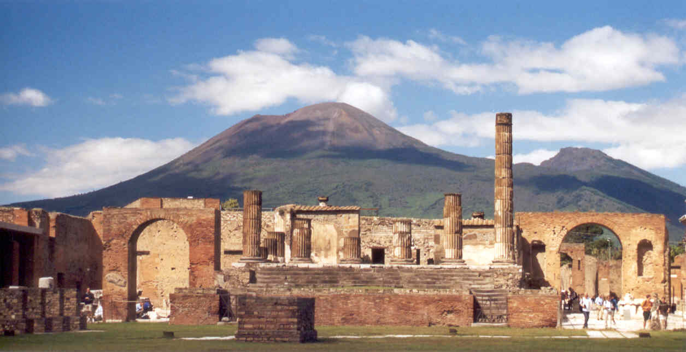

#### How to reach Pompei and Ercolano

<table style="width:100%">
   <tr>
     <td></td>
     <tr/>
</table>

[Pompei](https://en.wikipedia.org/wiki/Pompeii) and [Ercolano](https://en.wikipedia.org/wiki/Ercolano) are two famous archaeological sites that lie in the shadow of [Mount Vesuvius](https://en.wikipedia.org/wiki/Mount_Vesuvius), the active volcano that dominates the area. They were destroyed by pyroclastic flows during the massive eruption of Vesuvius in 79 AD.

**POMPEII ARCHAEOLOGICAL SITE:** Go to the central Naples train station at Piazza Garibaldi. You'll find the Circumvesuviana (the train system that connects Naples and the towns and cities in the region around Vesuvius) on the lower level of the station. Buy tickets (about 3 euro each way) and take the Circumvesuviana to *“Pompei Scavi”*. Note that other regional trains go to the modern city of Pompei but you will need to walk about 25 minutes from that station to the archaeological site while the station Pompei Scavi is just a few minutes from the entrance to the park. A single cafeteria serves the site, so you may want to bring snacks. It can be hot or warm, so dress accordingly. Pompei is a vast ruin, and a walk through most of it should take at least three hours. [Website](http://pompeiisites.org/en/)

**ERCOLANO ARCHAEOLOGICAL SITE:** Ercolano lies on the same train Circumvesuviana line as Pompei, but it is closer to Naples. Go to the central Naples train station at Piazza Garibaldi and go to Circumvesuviana station. Buy tickets and take the Circumvesuviana to *“Ercolano Scavi”*. Walk down the hill towards the sea for about ten minutes. Ercolano is much smaller than Pompei, but what it lacks in size it makes up in the quality of its preservation. It is possible to visit Ercolano and Pompei sites in one day, but you will probably want to start early. [Website](https://ercolano.beniculturali.it/)
