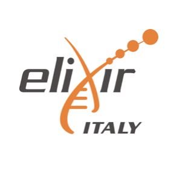

#### PRACTICAL COURSE

# EMBO Course in Population Genomics
### Naples (Italy), 10 – 16 June 2024

## Go to the [EMBO Popgen 2024 website](https://meetings.embo.org/event/24-pop-genomics) 

## Go to the [EMBO POPGEN Course Posters' page](https://www.jeangilder.it/pop-genomics/) 

## Connections

For this course we will work on the High Performance Cluster of the [Istituto Nazionale di Fisica Nucleare](https://home.infn.it/it/)

To connect to the machine using SSH, send us your public key. [Instructions on how to create your public key](https://github.com/ColonnaLab/EMBO_popgen/blob/main/popgen2024/connections/keypair.pdf)

[Instructions on how to connect to the machine](https://github.com/ColonnaLab/EMBO_popgen/blob/main/popgen2024/connections/README.md)

## Repos with teaching materials
| Speakers | Teaching materials |
|--------------------|-----------------|
| Chiara Batini | [materials](Chiara_Batini) |
| Vincenza Colonna| [materials](Vincenza_Colonna) |
| Matteo Fumagalli | [materials](Matteo_Fumagalli) |
| Erik Garrison | [materials](Erik_Garrison) |
| Tábita Hünemeier | [materials](Tábita_Hünemeier) |
| Loïc Lannelongue | [materials](Loic_Lannelongue) |
| Andrea Manica | [materials](Andrea_Manica) |
| Manolo Perez | [materials](Manolo_Perez) |
| Barbara Ottolini | [materials](Barbara_Ottolini) |
| Michèle Ramsay | [materials](Michele_Ramsay) |
| Leo Speidel | [materials](Leo_Speidel) |

### How to reach Pompei and Ercolano
If you want to visit Ercolano and Pompei, archaeological sites near Naples [here are the information on how to reach them](https://github.com/ColonnaLab/EMBO_popgen/tree/main/popgen2023/extra)

<table style="width:100%">
   <tr>
     <td></td> <td><a href="https://twitter.com/hashtag/EMBOpopgen?src=hashtag_click"><b>#EMBOpopgen</b></td>    
     <tr/>
</table>

<table width="700">
   <tr>
   <td></a></td>
   <td width="100"></td>
   <td></td>
   <td width="100"></td>
   <td align="center"></td>
      </tr>
      <tr>
      <td></td>
      <td width="100"></td>
      <td align="right"></td>
      <td width="100"></td>
      <td align="center"></td>
   </tr>
   <tr>
</table>
