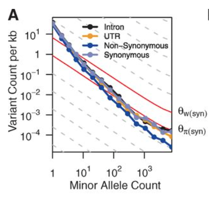
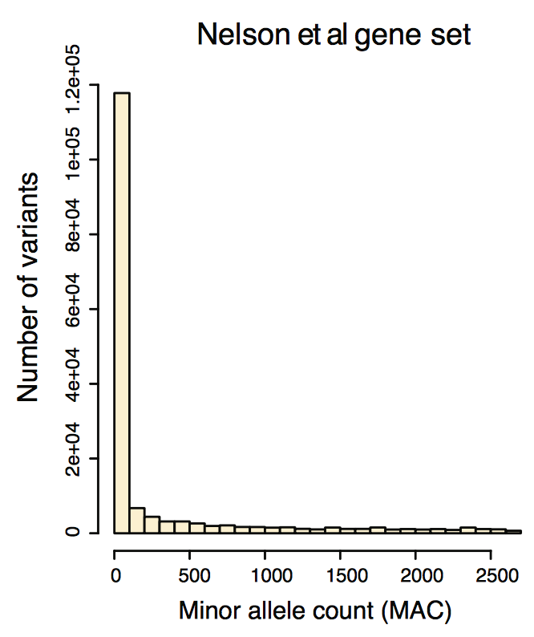

We sequenced several genomes of bears and assigned each individual genotype.
What is the frequency of a certain allele at the population level?


We have only a sample of the entire population of bears but we want to make inferences at the whole population level.

Our sample contains information for 100 individuals with the following genotypes: 63 AA, 34 AG, 3 GG.
A frequentist estimate of the frequency of G is given by: $(34+(3\times2))/200=40/200=0.20$.

#### What is the posterior distribution for the population frequency of G?

The first thing we need to do is define our likelihood model.
We can imagine to randomly sample one allele from the population and each time the allele can be either G or not.

This is a set of Bernoulli trials and we can use of Binomial distribution as likelihood function.

The Binomial likelihood is
\begin{equation}
     P(k|p,n) = ( \genfrac{}{}{0pt}{}{n}{k} ) p^k(1-p)^{n-k}
\end{equation}
where $k$ is the number of successes (i.e. the event of sampling a G), $p$ is the proportion of $G$ alleles we have (i.e. the probability of a success), and $n$ is the number of alleles we sample.

Recall that
\begin{equation}
    (\genfrac{}{}{0pt}{}{n}{k}) = \frac{n!}{k!(n-k)!}
\end{equation}

Note that the combinatorial term does not contain $p$.

What is the maximum likelihood estimate of $p$?

You may recall that it is $\hat{p}=\frac{k}{n}$.
Note that the combinatorial terms does not affect this estimate.

The second thing we need to do is define a prior probability for $p$.

What is the interval of values that $p$ can take?

It is $[0,1]$, as we express frequencies relative to the whole population/sample.
It is convenient to choose a prior distribution which is conjugate to the Binomial.

A Beta distribution is a conjugate prior in this case.

Are certain values of $p$ more likely to occur without observing the data?

If that it is not the case, can we use the Beta distribution to generate a non-informative prior?

We can choose $Beta(\alpha,\beta)$, which is defined as
\begin{equation}
    P(p) = \frac{1}{B(\alpha,\beta)} p^{\alpha-1}(1-p)^{\beta-1}
\end{equation}
where $\frac{1}{B(\alpha,\beta)}$ is simply a normalization term which does not depend on $p$. 
Furthermore, for $\alpha = \beta = 1$, this is the uniform distribution, and thus yields a non-informative prior.

The full model can be expressed as $P(p|k,n) \propto P(k|p,n)P(p)$.

The closed form for the posterior distribution given our choices for the likelihood and prior functions is

\begin{equation}
    P(p|k,n) \propto p^{k+\alpha-1}(1-p)^{n-k+\beta-1}
\end{equation}

The posterior distribution (Beta-Binomial model) is a Beta distribution with parameters $k+\alpha$ and $n-k+\beta$.

If we set $\alpha=\beta=1$ then $P(p|k,n)=Beta(k+1,n-k+1)$.
What are $k$ and $n$?

$n$ is the number of alleles we sample and $k$ is the occurrence of allele $G$ in our sample.

__A)__ 

Plot the posterior probability, assuming a uniform prior (alpha = beta = 1). Then calculate the maximum a posteriori value, 95\% credible intervals, and notable quantiles. 

What happens to the distribution if we have only 10 samples (with the sample allele frequency of 0.20)?

```{r}
# geno counts given
nAA <- 63
nAG <- 34
nGG <- 3
numGenos <- nAA + nAG + nGG

# get allele counts
nA <- 2*nAA + nAG
nG <- nAG + 2*nGG
numDraws <- nA + nG

# Plot posterior (assuming uniform prior alpha = beta = 1)
alpha <- nG + 1
beta <- nA + 1
xs <- seq (0, 1, 0.005)
ys <- dbeta (xs, alpha, beta)
plot (xs, ys, type='l')
```

MAP, 95% credibility, quantiles
```{r}
# mode or maximum of beta distribution is (alpha - 1)/(alpha + beta - 2) [from wikipedia]
MAP <- (alpha - 1)/(alpha + beta -2)
print (MAP)

# 95 credibility is not unique, but we take the [2.5-percentile, 97.5-percentile]
credLB <- qbeta (0.025, alpha, beta)
credUB <- qbeta (0.975, alpha, beta)
print (paste("95% credibility: ", credLB, credUB))

# some quartiles
myQuantiles <- c(0, 0.05, 0.25, 0.5, 0.75, 0.975, 1)
qbeta (myQuantiles, alpha, beta)
```

We can think of a more informative prior.
The genome-wide distribution of allele frequencies for human populations as a particular shape. This is called a site frequency spectrum (SFS) or allele frequency spectrum (AFS).



We can have another view at it by plotting the minor allele counts (MAC) distribution.



Does this distribution fit with a uniform prior?
Can we use a conjugate (Beta) function to model this distribution?

Also, we don't know _a priori_ whether the allele we are interested in is the minor allele.
Therefore a prior distribution with more density at both low and high frequencies might be more appropriate.

Answer:

Technically, the beta distribution is only defined for $\alpha > 0$ and $\beta > 0$, because otherwise the integral is infinity, and it is not a proper probability distribution. However, as we have seen, if we are careful, then we can use an improper priors in a Bayesian analysis.

This is very appealing in this case, since for $\alpha = 0$ and $\beta = 1$, the prior $\pi(p)$ is
\begin{equation}
  \pi(p) \propto p^{-1}
\end{equation}
which looks like this
```{r}
xs <- seq (0, 1, 0.01)
ys <- xs^(-1)
plot (xs, ys, type='l')
```

and is thus an appealing prior for the frequency of the derived (or minor) alleles.

Moreover, for $\alpha = \beta = 0$, we get
\begin{equation}
  \pi(p) \propto p^{-1}(1-p)^{-1}
\end{equation}
which yields
```{r}
xs <- seq (0, 1, 0.01)
ys <- xs^(-1) * (1-xs)^(-1)
plot (xs, ys, type='l')
```

and thus a good prior when we don't know which allele is the minor allele.

These improper priors work well, if we observe at least one allele of each type. We can also set $\alpha$ to a very small number close to 0, if we want to avoid the technical problems with setting it to zero.
 
 __B)__

Recalculate the posterior distribution of $p$ using an informative prior (make your own
choices regarding the parameter for the Beta distribution) both in the case of 100 and 10 samples.

Discuss how these results compare to the previous ones obtained in point A.

```{r}
# allele freqs from allele counts to change sample size
fA <- nA / (nA + nG)
fG <- nG / (nA + nG)

# plot both posteriors
xs <- seq (0, 1, 0.005)
hunPost <- dbeta (xs, 100*fG, 100*fA + 1)
tenPost <- dbeta (xs, 10*fG, 10*fA + 1)
plot (xs, hunPost, type='l', col='red')
lines (xs, tenPost, type='l', col='blue')
```

If our prior reflects that G should have a low frequency because it is the derived allele, then, for a sample of size 10, the estimate is shifted lower (and more uncertain) as compared to a sample of size 100. The latter is close to the estimate with an non-informative prior.

__C)__ (bonus)

Calculate the Bayes factor for a model with $p<=0.5$ vs a model with $p>0.5$. Note that these models are equally probable a priori.

```{r}
# models equally probable a priori
pLT <- 0.5
pGT <- 0.5

# posterior in both models is like full model with uniform prior, but then restricted to <0.5 or >0.5
# get marginal likelihoods under both models
pMargLT <- 1 - qbeta (0.5, nG + 1, nA + 1)
pMargGT <- qbeta (0.5, nG + 1, nA + 1)

# The ratio of the marginal data likelihoods is the bayes factor
BF <- pMargLT / pMargGT
print (BF)
```

