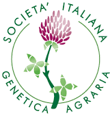

#### PRACTICAL COURSE

# EMBO Course in Population Genomics
### Castellammare di Stabia, Naples, Italy, 23 – 29 June 2025

#### PRACTICAL COURSE

## Go to the [EMBO Popgen 2025 website](https://meetings.embo.org/event/25-pop-genomics) 

## Go to the [EMBO POPGEN Course Posters' page](https://www.jeangilder.it/pop-genomics/) 

## TUTORIALS TO DO BEFORE THE COURSE
Basic knowledge of Unix, Python, and R is required. Unless you are fluent in all three, we strongly recommend reviewing the tutorials below before the course:

- UNIX:  (http://swcarpentry.github.io/shell-novice/)
- PYTHON: (https://swcarpentry.github.io/python-novice-inflammation/)
- R:  (http://swcarpentry.github.io/r-novice-gapminder/)
  
## Connections

For this course we will work on the High Performance Cluster. 
To connect to the machine via SSH, please send us your public key.[Instructions on how to create your public key](https://github.com/ColonnaLab/EMBO_popgen/blob/main/popgen2025/connections/EMBO_POPGEN2025_keypair.pdf)

[Instructions on how to connect to the machine]

## Repos with teaching materials
| Speakers | Teaching materials |
|--------------------|-----------------|
| Speakers | Teaching materials |
| Chiara Batini | [materials](Chiara_Batini) |
| Vincenza Colonna| [materials](Vincenza_Colonna) |
| Serena Aceto | [materials](Serena_Aceto) |
| Michael Hiller | [materials](Michael_Hiller) |
| Tábita Hünemeier | [materials](Tabita_Hunemeier) |
| Loïc Lannelongue | [materials](Loic_Lannelongue) |
| Oscar Lao | [materials](Oscar_Lao) |
| Andrea Manica | [materials](Andrea_Manica) |
| Franco Marsico | [materials](Franco_Marsico) |
| Manolo Perez | [materials](Manolo_Perez) |
| Marco Salvemini | [materials](Marco_Salvemini) |
| Matthias Steinrücken | [materials](Matthias_Steinrucken) |
| Serena Tucci | [materials](Serena_Tucci) |

<table style="width:100%">
   <tr>
     <td></td> <td><a href="https://twitter.com/hashtag/EMBOpopgen?src=hashtag_click"><b>#EMBOpopgen</b></td>    
     <tr/>
</table>

<table width="1000">
   <tr>
   <td></a></td>
   <td width="100"></td>
  <td></td>
  <td width="100"></td>
  <td align="center"></td>
  </tr>
  <tr>
<td align="right"></td>
  <td></td>
   <td align="center"></td>
<td align="center"></td>
</tr>
<tr>
</table>
